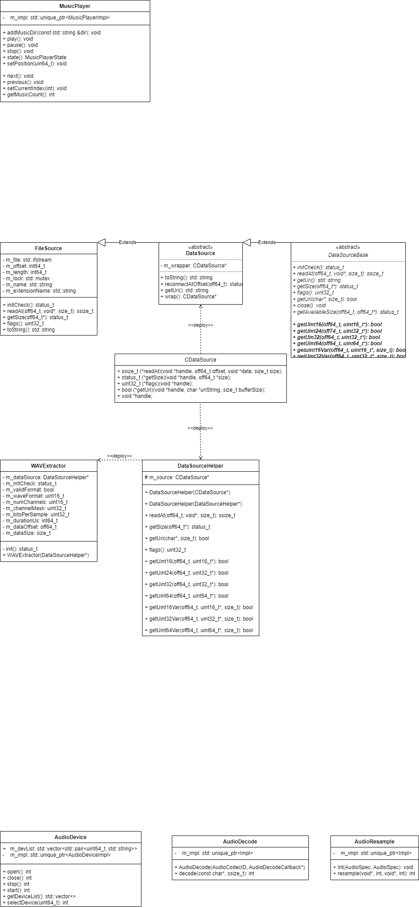

[toc]

# 设计文档

> 本文档仅维护设计与架构说明。
> 构建、运行、打包、测试命令请以仓库根目录下的 `README.md` 与 `AGENTS.md` 为准，避免与实现状态脱节。

## 整体架构

todo

## app

todo

## sdk

### 架构

SDK 模块边界与验证要求请同步参考根目录 `AGENTS.md`。

### 类图

[UML类图介绍](https://zhuanlan.zhihu.com/p/109655171)

