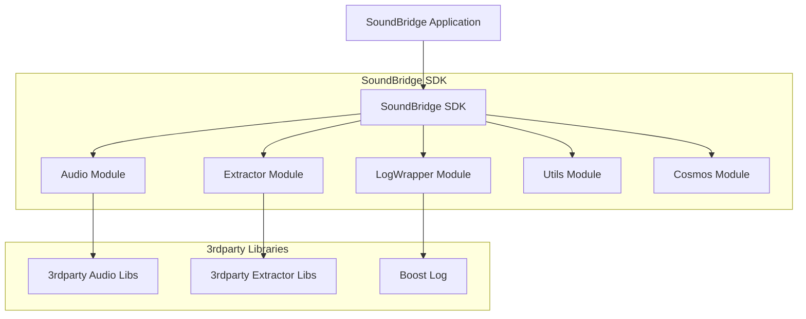
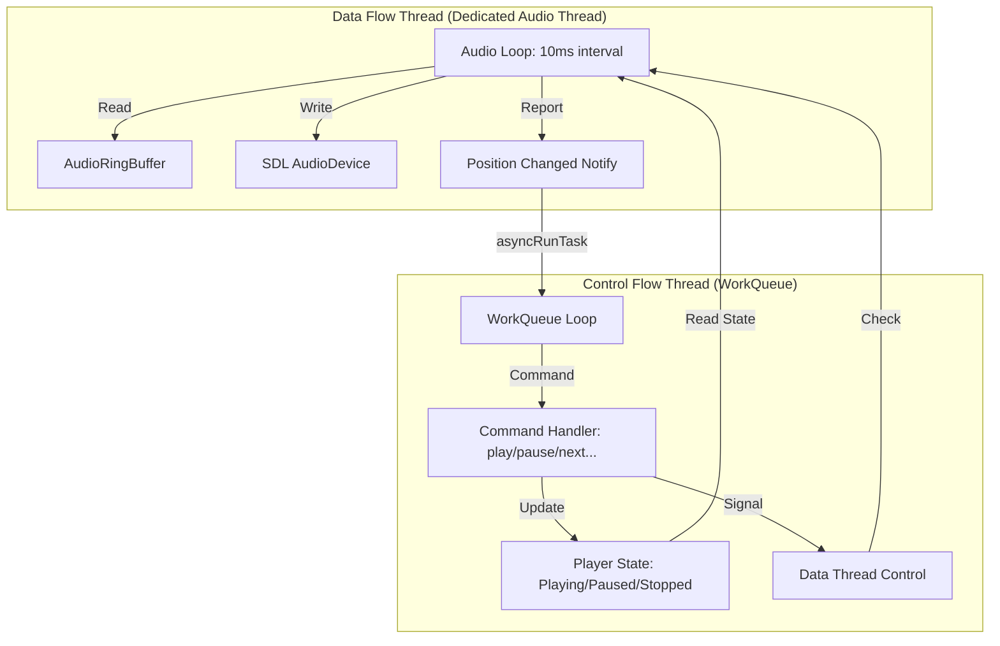

# SoundBridge 项目完整技术分析报告

---

## 第一部分：项目架构分析

### 1.1 项目概述

SoundBridge 是一个跨平台音乐播放器项目，旨在学习音频文件格式解析与解码。项目基于 Qt5 构建 GUI 界面，核心功能包括音频解码、设备管理、重采样以及多种音频格式的提取。项目结构清晰，主要分为 `app` 和 `sdk` 两大部分，并通过 `CMake` 进行构建管理。

### 1.2 模块结构与依赖关系

#### 1.2.1 SoundBridge Application (app)

`app` 目录包含了 SoundBridge 的用户界面和应用程序逻辑。它依赖于 `SoundBridge SDK` 来实现核心的音频处理功能。

主要文件：
- `main.cpp`：应用程序入口点
- `mainwindow.cpp`, `mainwindow.h`：主窗口的用户界面和交互逻辑
- `playercontroller.cpp`, `playercontroller.h`：播放器控制逻辑，与 SDK 进行交互

#### 1.2.2 SoundBridge SDK (sdk)

`sdk` 是 SoundBridge 的核心功能库，提供了音频处理的各项服务。它进一步细分为多个子模块，并集成了第三方库。

主要子模块：

| 模块名称 | 功能描述 |
| :--- | :--- |
| **Audio Module** | 负责音频的解码、设备管理和重采样。包含 `common`（通用定义）、`decode`（格式解码）、`device`（设备管理）、`resample`（重采样）子目录 |
| **Extractor Module** | 从音频文件中提取元数据和音频流，支持 AAC, AIFF, APE, ASF, FLAC, M4A, MKV, MP3, OGG, WAV 等格式 |
| **LogWrapper Module** | 提供日志记录功能，封装了 Boost Log |
| **Utils Module** | 通用工具函数和数据结构，如 `AudioBuffer`, `ByteUtils` |
| **Cosmos Module** | 通用 C++ 工具类，如 `Any.hpp`, `Optional.hpp`, `ThreadPool.hpp`, `WorkQueue.hpp` 等 |

#### 1.2.3 第三方库 (3rdparty)

`sdk` 模块依赖于多个第三方库：

| 第三方库 | 用途 |
| :--- | :--- |
| **FFmpeg** | 音频解码和处理 |
| **Boost** | 日志（Boost Log）、文件系统、线程等 |
| **SDL2** | 音频设备输出 |
| **FLAC** | FLAC 格式解码 |
| **OGG/Vorbis** | OGG 格式解码 |
| **Zlib** | 数据压缩 |

### 1.3 项目架构图



---

## 第二部分：单线程 WorkQueue 模式分析

### 2.1 WorkQueue 实现细节

在 SoundBridge 的源码中，`WorkQueue` 的核心实现位于 `sdk/cosmos/WorkQueue.hpp`。它是一个典型的单线程事件循环（Event Loop）实现，具备以下关键特性：

#### 线程模型与任务存储

`WorkQueue` 在构造时会启动一个专属的 `std::thread`，运行 `threadLoopFunc` 循环。任务被封装在 `TaskWrapper` 结构体中，包含任务 ID、执行函数（`std::function<void()>`）、预定执行时间、重复标志等。

任务的存储依赖于两个数据结构：
- **优先队列（Priority Queue）**：`m_taskQueue` 使用 `std::priority_queue`，根据任务的预定执行时间（`runTimePointUs`）进行排序，确保最先需要执行的任务位于队首。
- **哈希表（Hash Map）**：`m_taskMap` 使用 `std::unordered_map`，通过任务 ID 快速查找任务，主要用于任务的取消操作。

#### 任务类型与调度机制

该队列支持三种类型的任务提交：

| 任务类型 | 方法 | 说明 |
| :--- | :--- | :--- |
| 定时/周期任务 | `startTimerTask` | 允许指定延迟时间和是否重复执行。任务执行后，如果标记为重复，会自动更新下一次执行时间并重新入队 |
| 异步任务 | `asyncRunTask` | 立即入队，预定执行时间设为当前时间，由工作线程尽快执行 |
| 同步任务 | `syncRunTask` | 通过 `std::promise` 和 `std::future` 实现。提交任务后，调用线程会阻塞在 `future.wait()`，直到工作线程执行完该任务 |

调度循环 `threadLoopFunc` 使用 `std::condition_variable::wait_for` 来实现精确的睡眠和唤醒。

### 2.2 在项目中的使用场景与架构角色

在 SoundBridge 中，`WorkQueue` 扮演了**"序列化执行器"**和**"状态同步中枢"**的角色：

#### 播放控制与状态管理

在 `MusicPlayer.cpp` 和 `MusicPlayList.cpp` 中，几乎所有的状态变更操作（如 `play`、`pause`、`stop`、`next`、`previous`、`setCurrentIndex`）都被封装为异步任务提交给 `WorkQueue`。

这种设计的核心目的是**消除锁竞争**。通过将所有状态修改操作序列化到单一的 `WorkQueue` 线程中执行，避免了在业务逻辑中广泛使用 `std::mutex`，从而降低了死锁风险和代码复杂度。

#### 音频数据消费驱动

`MusicPlayer` 使用 `WorkQueue` 的定时任务功能（`startTimerTask`）启动了一个消费者任务（`consumeAudioData`），每 10 毫秒执行一次。该任务负责从 `AudioRingBuffer` 中读取解码后的 PCM 数据，并将其写入到底层的 `AudioDevice`（基于 SDL）。

在这里，`WorkQueue` 充当了**节拍器**的角色，以固定的频率驱动音频数据的流动。

### 2.3 优缺点分析

#### 优点

| 优点 | 详细说明 |
| :--- | :--- |
| **简化并发模型** | 通过将并发操作转化为顺序执行的任务，极大地减少了互斥锁的使用。降低了死锁和竞态条件的风险 |
| **状态一致性** | 所有对播放器核心状态的修改都在同一个线程内完成，天然保证了状态的强一致性 |
| **统一的定时器管理** | 将定时任务和普通任务统一在一个队列中处理，避免了维护多个独立定时器线程的开销 |

#### 缺点与潜在风险

| 缺点/风险 | 详细说明 |
| :--- | :--- |
| **单点性能瓶颈** | 所有任务都在同一个线程中排队执行。如果某个任务耗时过长（例如同步解码或慢速 I/O），会阻塞整个队列，导致音频卡顿（Buffer Underrun）或 UI 响应延迟 |
| **同步任务的死锁风险** | `syncRunTask` 会阻塞调用线程。如果调用线程持有某个锁，而 `WorkQueue` 中的任务也需要获取该锁，极易引发死锁 |
| **优先级反转** | 目前的实现仅按时间排序，没有任务优先级概念。关键的音频数据搬运任务可能被大量低优先级的状态查询或更新任务延迟 |

### 2.4 与量产项目架构的对比

| 量产项目 | 模式 | 与 SoundBridge 的对比 |
| :--- | :--- | :--- |
| **Chromium** | TaskRunner / SequencedTaskRunner | Chromium 明确规定不要在 UI 或 IO 线程上执行耗时操作。SoundBridge 将音频消费和状态管理混在一个线程，如果状态管理涉及耗时操作，可能影响音频播放的实时性 |
| **Android** | Handler / Looper | Android 的 `MessageQueue` 支持消息屏障（Sync Barrier）和空闲处理（IdleHandler）机制，允许在队列空闲时执行低优先级任务，这是 SoundBridge 目前缺乏的 |
| **iOS** | GCD Serial Queue | GCD 的串行队列非常轻量，系统底层维护线程池。SoundBridge 的 `WorkQueue` 每次实例化都会创建一个物理线程，多实例时可能导致线程数量膨胀 |
| **VLC** | 多线程流水线 | VLC 将解复用、解码和输出分离到不同独立线程，通过 FIFO 队列传递数据。SoundBridge 将控制流和数据流耦合在同一个 `WorkQueue`，扩展性不如 VLC 的流水线架构 |

---

## 第三部分：控制流与数据流分离优化方案

### 3.1 当前问题

在当前实现中，`MusicPlayer::Impl` 使用单线程 `WorkQueue` 处理所有任务：
- **控制流**：所有播放控制命令（`play`, `pause`, `stop`, `next`, `previous`）通过 `asyncRunTask` 异步提交
- **数据流**：音频数据消费（`consumeAudioData`）通过 `startTimerTask` 注册为每 10ms 执行一次的定时任务
- **核心冲突**：控制流任务（如切歌时的文件 IO 或解码器重置）耗时较长时，会阻塞 `consumeAudioData`，导致音频卡顿

### 3.2 优化方案：双线程模型

将控制流（状态管理、列表操作、文件 IO）与数据流（音频数据读取、SDL 写入）彻底分离，引入专门的音频消费线程。

#### 职责划分

| 线程类型 | 职责描述 | 核心操作 |
| :--- | :--- | :--- |
| **控制流线程 (WorkQueue)** | 响应用户指令，管理播放列表，控制解码器状态，处理文件 IO | `_play()`, `_pause()`, `_next()`, `seekToMs()` |
| **数据流线程 (Dedicated Audio Thread)** | 严格定时（10ms）从缓冲区读取 PCM 数据并推送到音频设备 | `ringBuffer->read()`, `audioDev->write()` |

#### 通信机制

1. **状态同步**：使用 `std::atomic<MusicPlayerState>` 管理播放状态，数据线程根据状态决定是写入音频、填充静音还是休眠
2. **数据传输**：继续使用 `AudioRingBuffer` 作为生产者（解码器）和消费者（音频线程）之间的中转，但消费端移至专用线程
3. **异步回调**：数据线程产生的进度更新（Position Changed）通过 `WorkQueue.asyncRunTask` 发送回控制线程，避免在音频线程执行耗时的回调函数

#### 优化后架构图



### 3.3 需要修改的文件

| 文件 | 修改内容 |
| :--- | :--- |
| `sdk/MusicPlayer.cpp` | 移除 `WorkQueue` 中的 `consumeAudioData` 定时任务，引入独立的 `std::thread` 或专用 `AudioWorkQueue` |
| `sdk/audio/device/AudioDevice.h/cpp` | 确保 `write` 和 `getQueuedBytes` 是线程安全的 |

### 3.4 关键代码示例

```cpp
// 在 MusicPlayer::Impl 中引入新的线程管理
class MusicPlayer::Impl {
private:
    // ... 现有成员 ...
    std::thread m_audioThread;
    std::atomic<bool> m_audioThreadRunning{false};
    std::condition_variable m_audioCV;
    std::mutex m_audioMtx;

    void audioThreadLoop() {
        while (m_audioThreadRunning) {
            auto startTime = std::chrono::steady_clock::now();
            
            // 1. 处理音频消费
            consumeAudioData();
            
            // 2. 严格控制 10ms 周期
            auto endTime = std::chrono::steady_clock::now();
            auto elapsed = std::chrono::duration_cast<std::chrono::milliseconds>(
                endTime - startTime);
            if (elapsed < std::chrono::milliseconds(10)) {
                std::this_thread::sleep_for(std::chrono::milliseconds(10) - elapsed);
            }
        }
    }

    void startAudioThread() {
        if (!m_audioThreadRunning) {
            m_audioThreadRunning = true;
            m_audioThread = std::thread(&Impl::audioThreadLoop, this);
        }
    }

    void stopAudioThread() {
        m_audioThreadRunning = false;
        if (m_audioThread.joinable()) {
            m_audioThread.join();
        }
    }
};
```

### 3.5 优化后的好处与注意事项

#### 好处

- **消除卡顿**：音频消费不再受 UI 操作或复杂业务逻辑的干扰，保证极高的实时性
- **响应速度提升**：控制指令可以立即被 `WorkQueue` 接收处理，无需等待音频消费任务完成
- **架构清晰**：符合关注点分离原则，控制流专注于"做什么"，数据流专注于"怎么传"

#### 注意事项

- **线程安全**：`AudioRingBuffer` 和 `StreamDecoder` 现在会被两个线程访问，必须确保内部实现线程安全
- **资源竞争**：切歌时控制线程重置解码器和缓冲区，此时音频线程可能正在读取，需要通过原子变量或 Mutex 进行精细同步
- **CPU 占用**：专用线程的轮询需要合理休眠，避免在暂停状态下空转消耗 CPU

---

## 第四部分：测试方案

### 4.1 测试策略

本次重构将原有的单线程模型拆分为双线程模型。核心风险在于**线程间同步**、**状态一致性**以及**音频数据的连续性**。测试策略包含以下层面：

1. **单元测试 (Unit Testing)**：分别验证控制流线程和数据流线程的独立行为
2. **集成测试 (Integration Testing)**：验证两线程的交互，特别是切歌、暂停/恢复、Seek 等操作时的状态同步
3. **并发压力测试 (Stress Testing)**：模拟高频 UI 操作，验证是否存在死锁、崩溃或内存泄漏
4. **音频质量验证 (Audio Quality Verification)**：验证各种操作下是否出现卡顿或爆音
5. **回归测试 (Regression Testing)**：确保原有测试用例在双线程下依然通过

### 4.2 控制流线程单元测试

| 用例编号 | 测试场景 | 预期结果 |
| :--- | :--- | :--- |
| CT-01 | 正常状态切换 | Play -> Pause -> Play -> Stop 状态流转正确，内部状态变量更新无误 |
| CT-02 | 连续重复指令 | 连续发送 Play 或 Pause 指令，状态机不应发生异常，忽略冗余指令 |
| CT-03 | 播放列表管理 | Next/Previous 操作正确更新当前曲目索引，并触发解码器切换 |
| CT-04 | 异常状态处理 | 在未加载曲目时调用 Play，应返回错误回调，状态保持 Stopped |

### 4.3 数据流线程单元测试

| 用例编号 | 测试场景 | 预期结果 |
| :--- | :--- | :--- |
| DT-01 | 定时精度验证 | 线程唤醒周期应严格在 10ms 左右（允许 ±1ms 误差） |
| DT-02 | 数据连续性读取 | 当 RingBuffer 数据充足时，每次读取固定长度，无遗漏 |
| DT-03 | Underrun 处理 | 当 RingBuffer 数据不足时，应填入静音数据，不应崩溃或读取脏数据 |
| DT-04 | 线程启停生命周期 | 启动和停止数据线程不应泄漏资源，停止后不再有数据写入 AudioDevice |

### 4.4 两线程交互集成测试

| 用例编号 | 测试场景 | 预期结果 |
| :--- | :--- | :--- |
| IT-01 | 暂停/恢复同步 | 控制流下发 Pause，数据流线程应立即停止读取并写入静音；下发 Play 后恢复读取 |
| IT-02 | 切歌竞态处理 | 控制流下发 Next，重置 RingBuffer，数据流线程不应读到上一首的残余数据（无爆音） |
| IT-03 | Seek 同步 | 控制流下发 Seek，清空 RingBuffer，数据流线程等待新数据到达后再写入 AudioDevice |
| IT-04 | 错误恢复同步 | 解码器出错触发自动跳曲，数据流线程应平滑过渡到下一首，无死锁 |

### 4.5 并发压力测试

| 用例编号 | 测试场景 | 预期结果 |
| :--- | :--- | :--- |
| ST-01 | 高频切歌 | 1秒内连续触发 50 次 Next/Previous，程序不崩溃，最终稳定在最后一首 |
| ST-02 | 快速暂停/恢复 | 1秒内连续触发 50 次 Play/Pause，状态机不混乱，音频设备不报错 |
| ST-03 | 随机指令轰炸 | 多线程并发向控制流发送随机指令（Play, Pause, Seek, Next），无死锁，无内存泄漏 |

### 4.6 音频质量验证

| 用例编号 | 测试场景 | 预期结果 |
| :--- | :--- | :--- |
| AQ-01 | 正常播放无卡顿 | 播放 5 分钟标准音频，记录 Underrun 次数，应为 0 |
| AQ-02 | 切歌无爆音 | 捕获切歌瞬间的 PCM 数据，验证无突变的高频噪声 |

### 4.7 C++ 测试代码示例

以下是基于 `doctest` 框架的集成测试代码示例，验证控制流与数据流线程的基本交互：

```cpp
#include <doctest/doctest.h>
#include <AudioRingBuffer.h>
#include <WorkQueue.hpp>
#include <atomic>
#include <chrono>
#include <thread>
#include <vector>
#include <numeric>

// 模拟专用的音频数据线程
void audioDataThreadFunc(AudioRingBuffer* ringBuffer,
                         std::atomic<bool>& isPlaying,
                         std::atomic<bool>& shutdown,
                         std::atomic<size_t>& totalBytesRead) {
    const std::chrono::milliseconds period(10); // 10ms 周期
    while (!shutdown.load()) {
        auto start_time = std::chrono::steady_clock::now();

        if (isPlaying.load()) {
            const size_t chunkSize = 1024;
            std::vector<char> buffer(chunkSize);
            size_t bytesRead = ringBuffer->read(buffer.data(), chunkSize);
            if (bytesRead > 0) {
                totalBytesRead.fetch_add(bytesRead);
            }
            // Underrun 时填充静音，不崩溃
        }

        auto end_time = std::chrono::steady_clock::now();
        auto elapsed_time = std::chrono::duration_cast<std::chrono::milliseconds>(
            end_time - start_time);
        if (elapsed_time < period) {
            std::this_thread::sleep_for(period - elapsed_time);
        }
    }
}

TEST_SUITE("DualThreadAudioEngine") {
    TEST_CASE("Control and Data Thread Basic Interaction") {
        // 1. 初始化 AudioRingBuffer
        AudioRingBuffer ringBuffer(4096);

        // 2. 初始化原子状态变量
        std::atomic<bool> isPlaying(false);
        std::atomic<bool> shutdown(false);
        std::atomic<size_t> totalBytesRead(0);

        // 3. 启动模拟音频数据线程
        std::thread dataThread(audioDataThreadFunc, &ringBuffer,
                               std::ref(isPlaying), std::ref(shutdown),
                               std::ref(totalBytesRead));

        // 4. 初始化 WorkQueue (模拟控制流线程)
        WorkQueue controlQueue;

        // 5. 模拟控制流操作：写入数据
        std::vector<char> testData(2048);
        std::iota(testData.begin(), testData.end(), 0);

        controlQueue.asyncRunTask([&]() {
            size_t written = ringBuffer.write(testData.data(), testData.size());
            REQUIRE(written == testData.size());
        });

        std::this_thread::sleep_for(std::chrono::milliseconds(50));

        // 6. 模拟控制流操作：开始播放
        controlQueue.asyncRunTask([&]() {
            isPlaying.store(true);
        });

        std::this_thread::sleep_for(std::chrono::milliseconds(200));

        // 7. 模拟控制流操作：暂停播放
        controlQueue.asyncRunTask([&]() {
            isPlaying.store(false);
        });

        // 暂停后验证数据读取停止
        size_t bytesReadBeforePause = totalBytesRead.load();
        std::this_thread::sleep_for(std::chrono::milliseconds(100));
        size_t bytesReadAfterPause = totalBytesRead.load();
        REQUIRE(bytesReadAfterPause == bytesReadBeforePause);

        // 8. 模拟控制流操作：恢复播放
        controlQueue.asyncRunTask([&]() {
            isPlaying.store(true);
        });

        std::this_thread::sleep_for(std::chrono::milliseconds(100));
        size_t bytesReadAfterResume = totalBytesRead.load();
        REQUIRE(bytesReadAfterResume > bytesReadAfterPause);

        // 9. 停止数据线程
        shutdown.store(true);
        dataThread.join();

        REQUIRE(totalBytesRead.load() > 0);
    }
}
```

### 4.8 CI/CD 集成建议

| 环节 | 建议 |
| :--- | :--- |
| **自动化构建** | 每次代码提交后 CI 自动编译项目及所有测试代码 |
| **单元/集成测试** | 每次提交或 MR 时自动运行，通过是合并的先决条件 |
| **并发压力测试** | 作为夜间构建或定期任务运行，设置超时机制 |
| **音频质量验证** | 集成 `ffmpeg` + `sox` 自动分析输出音频波形，关键发布进行人工听音复核 |
| **静态分析** | 集成 `Clang-Tidy`、`Cppcheck` 检查并发问题 |
| **代码覆盖率** | 使用 `gcov`/`lcov` 确保线程间通信和同步部分被充分覆盖 |

---

## 参考文献

[1] Chromium Docs. "Threading and Tasks in Chrome". https://chromium.googlesource.com/chromium/src/+/main/docs/threading_and_tasks.md

[2] Anmol Sehgal. "Understanding Android's Handler-Looper Mechanism". Medium.

[3] Apple Developer Documentation. "Dispatch Queues". https://developer.apple.com/library/archive/documentation/General/Conceptual/ConcurrencyProgrammingGuide/OperationQueues/OperationQueues.html

[4] VideoLAN. "VLC media player source code". https://github.com/videolan/vlc

[5] SDL Wiki. "SDL2 Audio Documentation". https://wiki.libsdl.org/SDL2/CategoryAudio
